# Diagramas de Arquitetura

## 1. Diagrama de Sequência - Criar Lançamento

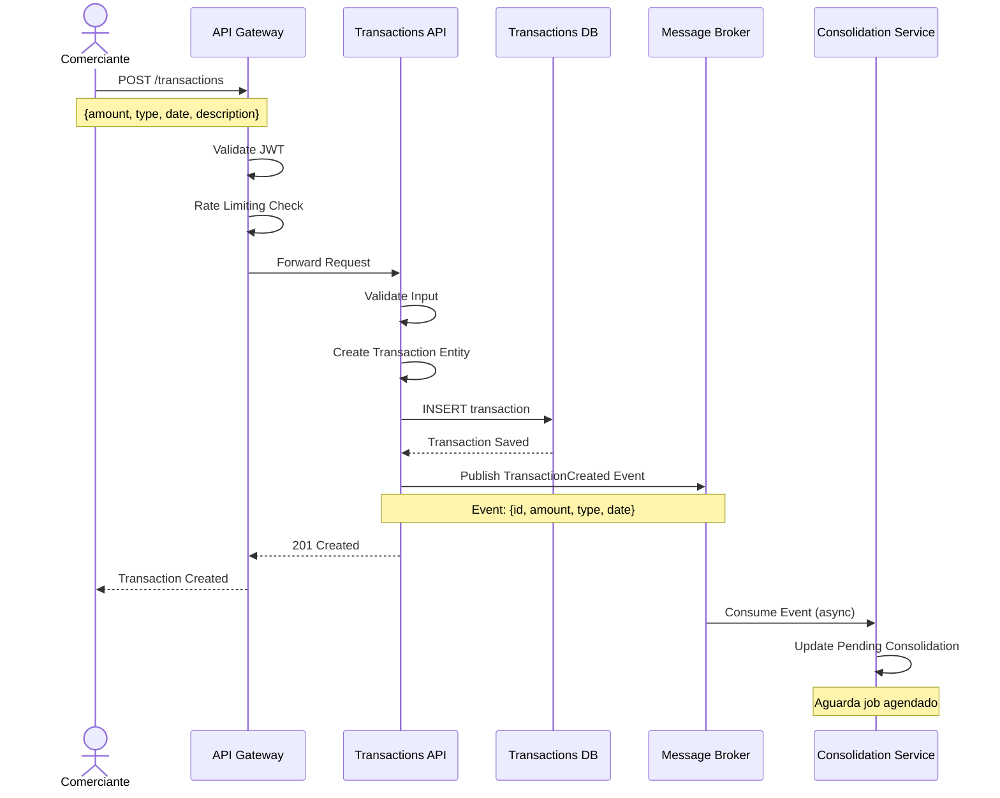

## 2. Diagrama de Sequência - Consolidação Diária

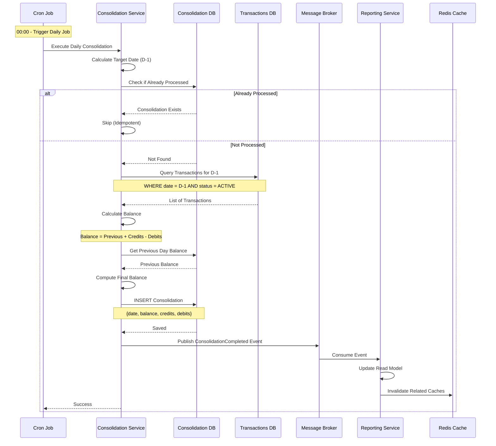

## 3. Diagrama de Sequência - Consultar Relatório

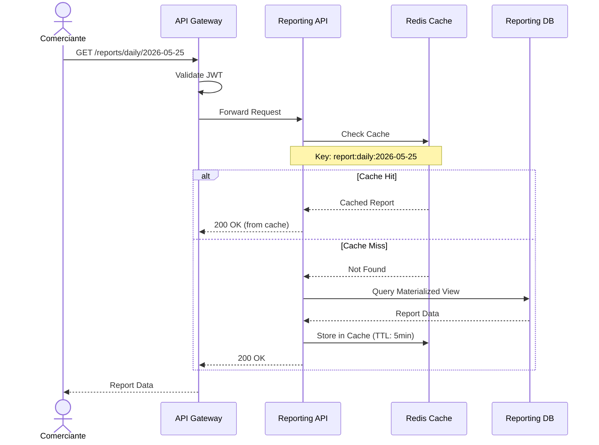

## 4. Diagrama de Fluxo - Processamento de Lançamento

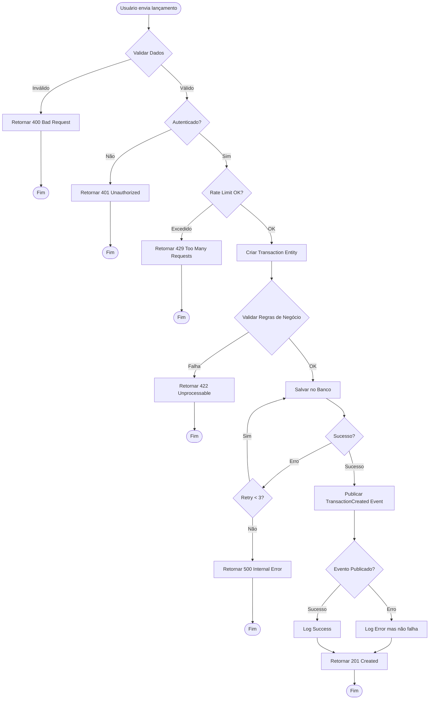

## 5. Diagrama de Fluxo - Consolidação Diária

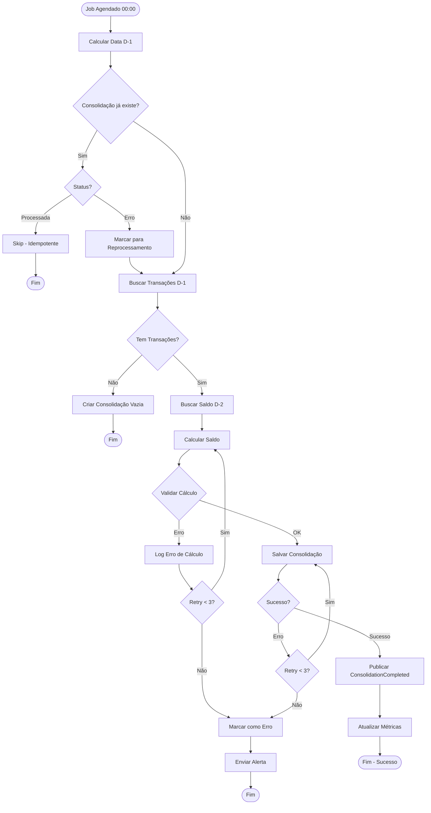

## 6. Diagrama de Componentes - Transactions Service

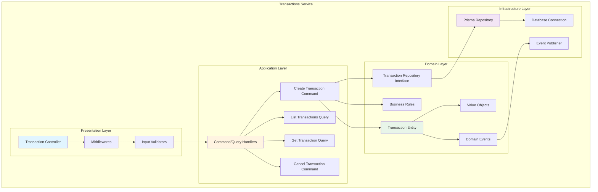

## 7. Diagrama de Deployment - Ambiente Local (Docker Compose)

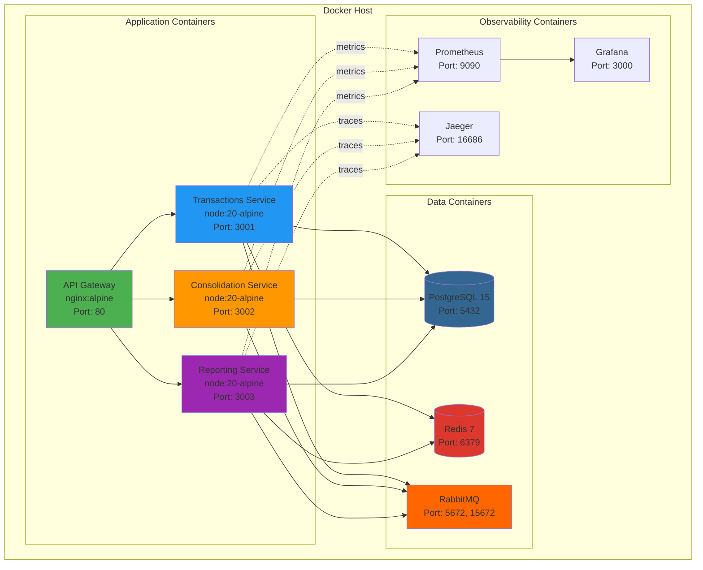

## 8. Diagrama de Deployment - Ambiente Kubernetes

```mermaid
graph TB
    subgraph "Kubernetes Cluster"
        subgraph "Ingress"
            Ingress[Ingress Controller<br/>NGINX/Traefik]
        end
        
        subgraph "Application Namespace"
            subgraph "Transactions Deployment"
                TxnPod1[Txn Pod 1]
                TxnPod2[Txn Pod 2]
                TxnSvc[Txn Service<br/>ClusterIP]
            end
            
            subgraph "Consolidation Deployment"
                ConsPod1[Cons Pod 1]
                ConsPod2[Cons Pod 2]
                ConsSvc[Cons Service<br/>ClusterIP]
            end
            
            subgraph "Reporting Deployment"
                RepPod1[Rep Pod 1]
                RepPod2[Rep Pod 2]
                RepSvc[Rep Service<br/>ClusterIP]
            end
        end
        
        subgraph "Data Namespace"
            PostgresStateful[PostgreSQL<br/>StatefulSet]
            RedisStateful[Redis<br/>StatefulSet]
            RabbitStateful[RabbitMQ<br/>StatefulSet]
            
            PVC1[(PVC - Postgres)]
            PVC2[(PVC - Redis)]
            PVC3[(PVC - RabbitMQ)]
        end
        
        subgraph "Monitoring Namespace"
            PromDeploy[Prometheus<br/>Deployment]
            GrafanaDeploy[Grafana<br/>Deployment]
            JaegerDeploy[Jaeger<br/>Deployment]
        end
        
        subgraph "ConfigMaps & Secrets"
            ConfigMap[ConfigMaps]
            Secrets[Secrets]
        end
    end
    
    Ingress --> TxnSvc
    Ingress --> ConsSvc
    Ingress --> RepSvc
    
    TxnSvc --> TxnPod1
    TxnSvc --> TxnPod2
    
    ConsSvc --> ConsPod1
    ConsSvc --> ConsPod2
    
    RepSvc --> RepPod1
    RepSvc --> RepPod2
    
    TxnPod1 --> PostgresStateful
    TxnPod2 --> PostgresStateful
    ConsPod1 --> PostgresStateful
    ConsPod2 --> PostgresStateful
    RepPod1 --> PostgresStateful
    RepPod2 --> PostgresStateful
    
    TxnPod1 --> RedisStateful
    TxnPod2 --> RedisStateful
    RepPod1 --> RedisStateful
    RepPod2 --> RedisStateful
    
    TxnPod1 --> RabbitStateful
    TxnPod2 --> RabbitStateful
    ConsPod1 --> RabbitStateful
    ConsPod2 --> RabbitStateful
    RepPod1 --> RabbitStateful
    RepPod2 --> RabbitStateful
    
    PostgresStateful --> PVC1
    RedisStateful --> PVC2
    RabbitStateful --> PVC3
    
    TxnPod1 -.-> ConfigMap
    TxnPod1 -.-> Secrets
    ConsPod1 -.-> ConfigMap
    ConsPod1 -.-> Secrets
    RepPod1 -.-> ConfigMap
    RepPod1 -.-> Secrets
    
    TxnPod1 -.->|metrics| PromDeploy
    ConsPod1 -.->|metrics| PromDeploy
    RepPod1 -.->|metrics| PromDeploy
    
    PromDeploy --> GrafanaDeploy
    
    style Ingress fill:#4CAF50
    style TxnPod1 fill:#2196F3
    style TxnPod2 fill:#2196F3
    style ConsPod1 fill:#FF9800
    style ConsPod2 fill:#FF9800
    style RepPod1 fill:#9C27B0
    style RepPod2 fill:#9C27B0
```

## 9. Diagrama de Estados - Transaction

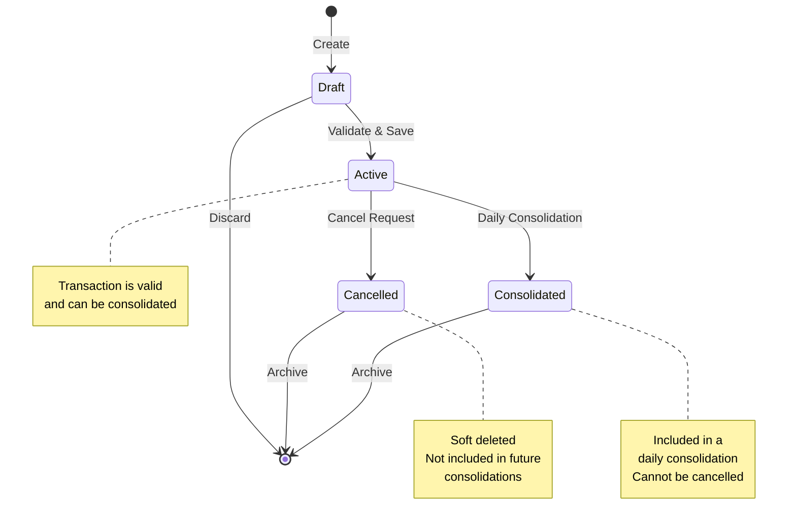

## 10. Diagrama de Estados - Consolidation

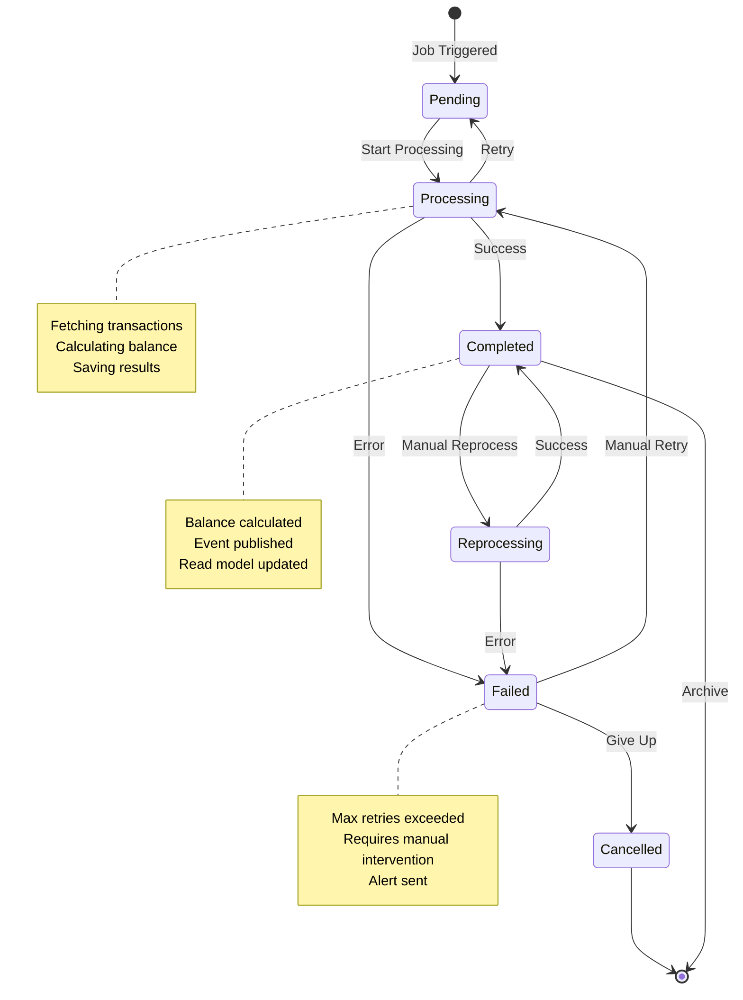

## 11. Diagrama de Contexto de Integração

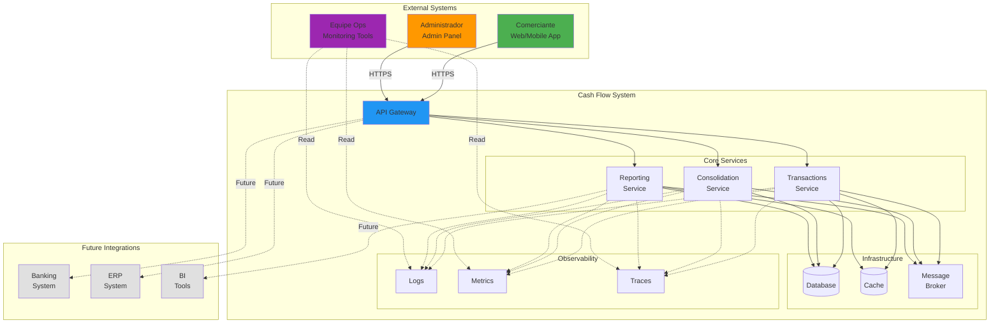

## 12. Diagrama de Resiliência - Circuit Breaker

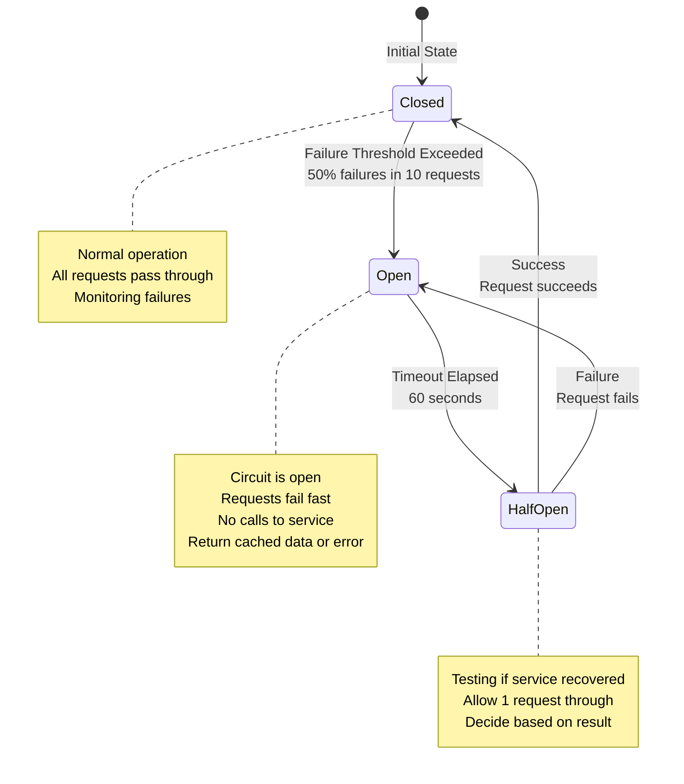

## 13. Diagrama de Dados - Modelo Conceitual

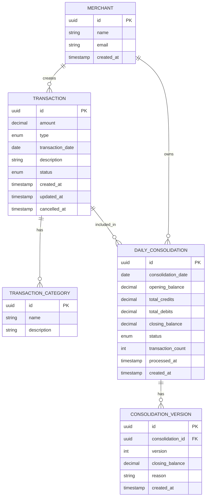

## 14. Legenda de Cores e Símbolos

### Cores dos Diagramas
- 🟢 **Verde (#4CAF50):** Entrada/Gateway/Usuário
- 🔵 **Azul (#2196F3):** Serviços de Aplicação
- 🟠 **Laranja (#FF9800):** Processamento/Jobs
- 🟣 **Roxo (#9C27B0):** Relatórios/Leitura
- 🔴 **Vermelho (#DC382D):** Cache/Redis
- 🟤 **Marrom (#336791):** Banco de Dados
- ⚫ **Cinza (#E0E0E0):** Integrações Futuras

### Símbolos
- `-->` : Comunicação síncrona (REST)
- `-.->` : Comunicação assíncrona (Events)
- `==>` : Fluxo de dados
- `[*]` : Estado inicial/final
- `()` : Cilindro = Banco de Dados
- `[]` : Retângulo = Serviço/Componente