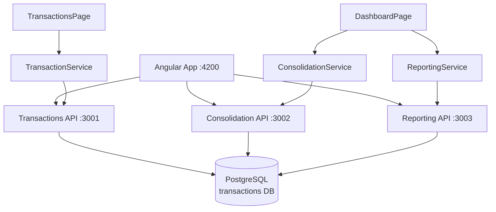
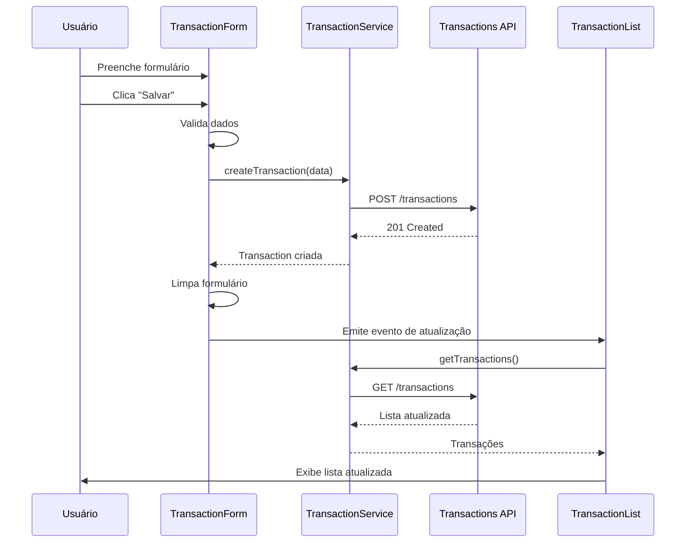

# 🚀 MVP Frontend Angular - Versão Simplificada (Sem Autenticação)

**Data**: 27/05/2026  
**Framework**: Angular 17+ (Standalone Components)  
**Objetivo**: Testar APIs do Cash Flow System com interface mínima

---

## 🎯 Escopo Reduzido

### ✅ O que SERÁ implementado

**Tela 1: Transações**
- ✅ Formulário para criar transação (crédito/débito)
- ✅ Lista de transações com paginação
- ✅ Filtro por data e tipo
- ✅ Cancelar transação

**Tela 2: Dashboard**
- ✅ Cards com métricas (saldo, créditos, débitos)
- ✅ Gráfico de evolução de saldo
- ✅ Filtro de período
- ✅ Resumo consolidado

**Navegação**
- ✅ Menu simples entre as duas telas
- ✅ Header com título da aplicação

### ❌ O que NÃO será implementado

- ❌ Sistema de autenticação/login
- ❌ Guards de rota
- ❌ Interceptors de autenticação
- ❌ Gestão de usuários
- ❌ Permissões
- ❌ Sidebar complexa
- ❌ Temas customizáveis
- ❌ Exportação de relatórios

---

## 🏗️ Arquitetura Simplificada

### Estrutura de Pastas (Standalone)

```
frontend/
├── src/
│   ├── app/
│   │   ├── models/                    # Interfaces TypeScript
│   │   │   ├── transaction.model.ts
│   │   │   ├── balance.model.ts
│   │   │   └── dashboard.model.ts
│   │   │
│   │   ├── services/                  # Serviços HTTP
│   │   │   ├── transaction.service.ts
│   │   │   ├── consolidation.service.ts
│   │   │   └── reporting.service.ts
│   │   │
│   │   ├── components/                # Componentes Standalone
│   │   │   ├── header/
│   │   │   │   ├── header.component.ts
│   │   │   │   ├── header.component.html
│   │   │   │   └── header.component.scss
│   │   │   │
│   │   │   ├── transactions/
│   │   │   │   ├── transaction-form/
│   │   │   │   │   ├── transaction-form.component.ts
│   │   │   │   │   ├── transaction-form.component.html
│   │   │   │   │   └── transaction-form.component.scss
│   │   │   │   │
│   │   │   │   ├── transaction-list/
│   │   │   │   │   ├── transaction-list.component.ts
│   │   │   │   │   ├── transaction-list.component.html
│   │   │   │   │   └── transaction-list.component.scss
│   │   │   │   │
│   │   │   │   └── transactions-page/
│   │   │   │       ├── transactions-page.component.ts
│   │   │   │       ├── transactions-page.component.html
│   │   │   │       └── transactions-page.component.scss
│   │   │   │
│   │   │   └── dashboard/
│   │   │       ├── balance-cards/
│   │   │       │   ├── balance-cards.component.ts
│   │   │       │   ├── balance-cards.component.html
│   │   │       │   └── balance-cards.component.scss
│   │   │       │
│   │   │       ├── balance-chart/
│   │   │       │   ├── balance-chart.component.ts
│   │   │       │   ├── balance-chart.component.html
│   │   │       │   └── balance-chart.component.scss
│   │   │       │
│   │   │       └── dashboard-page/
│   │   │           ├── dashboard-page.component.ts
│   │   │           ├── dashboard-page.component.html
│   │   │           └── dashboard-page.component.scss
│   │   │
│   │   ├── app.component.ts
│   │   ├── app.component.html
│   │   ├── app.component.scss
│   │   ├── app.routes.ts
│   │   └── app.config.ts
│   │
│   ├── environments/
│   │   ├── environment.ts
│   │   └── environment.prod.ts
│   │
│   ├── styles.scss
│   └── main.ts
│
├── angular.json
├── package.json
├── tsconfig.json
└── README.md
```

---

## 🔌 Integração com APIs

### Configuração de Ambiente

```typescript
// environments/environment.ts
export const environment = {
  production: false,
  apiUrls: {
    transactions: 'http://localhost:3001',
    consolidation: 'http://localhost:3002',
    reporting: 'http://localhost:3003'
  }
};
```

### Endpoints Utilizados

#### 1. Transactions Service (Port 3001)

```typescript
// transaction.service.ts

// Criar transação
POST http://localhost:3001/transactions
Body: {
  idempotencyKey: string;
  amount: number;
  type: 'CREDIT' | 'DEBIT';
  date: string; // ISO format
  description: string;
  categoryId?: string;
}

// Listar transações
GET http://localhost:3001/transactions?page=1&limit=20&startDate=2026-05-01&endDate=2026-05-31&type=CREDIT

// Buscar transação por ID
GET http://localhost:3001/transactions/:id

// Cancelar transação
PATCH http://localhost:3001/transactions/:id/cancel
Body: {
  reason: string;
}
```

#### 2. Consolidation Service (Port 3002)

```typescript
// consolidation.service.ts

// Saldo de uma data específica
GET http://localhost:3002/consolidation/balance/2026-05-27

// Histórico de saldos
GET http://localhost:3002/consolidation/balance?startDate=2026-05-01&endDate=2026-05-31

// Resumo consolidado
GET http://localhost:3002/consolidation/summary?startDate=2026-05-01&endDate=2026-05-31
```

#### 3. Reporting Service (Port 3003)

```typescript
// reporting.service.ts

// Relatório de transações
GET http://localhost:3003/api/transactions?startDate=2026-05-01&endDate=2026-05-31&page=1&limit=20

// Dashboard completo
GET http://localhost:3003/api/dashboard
```

---

## 📱 Detalhamento das Telas

### Tela 1: Transações (`/transactions`)

**Layout Visual:**
```
┌────────────────────────────────────────────────────────┐
│  💰 Cash Flow System    [Transações] [Dashboard]      │
├────────────────────────────────────────────────────────┤
│                                                        │
│  ┌──────────────────────────────────────────────────┐ │
│  │  📝 Nova Transação                               │ │
│  │  ┌──────────┐  ┌──────────┐  ┌──────────┐      │ │
│  │  │ Valor    │  │ Tipo     │  │ Data     │      │ │
│  │  │ R$ 0,00  │  │ Crédito ▼│  │ 27/05/26 │      │ │
│  │  └──────────┘  └──────────┘  └──────────┘      │ │
│  │  ┌────────────────────────────────────────────┐ │ │
│  │  │ Descrição                                  │ │ │
│  │  └────────────────────────────────────────────┘ │ │
│  │  ┌──────────┐  [Salvar Transação]             │ │
│  │  │Categoria▼│                                  │ │
│  │  └──────────┘                                  │ │
│  └──────────────────────────────────────────────────┘ │
│                                                        │
│  ┌──────────────────────────────────────────────────┐ │
│  │  📋 Transações Recentes                          │ │
│  │  ┌────────────────────────────────────────────┐  │ │
│  │  │ Filtros: [Data Início] [Data Fim] [Tipo▼] │  │ │
│  │  │          [Buscar]                          │  │ │
│  │  └────────────────────────────────────────────┘  │ │
│  │                                                  │ │
│  │  Data      │ Descrição      │ Tipo   │ Valor    │ │
│  │  ──────────┼────────────────┼────────┼──────────│ │
│  │  27/05/26  │ Venda Produto  │ 💚 Créd│ R$ 1.500 │ │
│  │  27/05/26  │ Compra Estoque │ 🔴 Déb │ R$ 500   │ │
│  │  26/05/26  │ Pagamento      │ 🔴 Déb │ R$ 300   │ │
│  │                                                  │ │
│  │  [◀ Anterior]  Página 1 de 5  [Próxima ▶]      │ │
│  └──────────────────────────────────────────────────┘ │
└────────────────────────────────────────────────────────┘
```

**Componentes:**

1. **HeaderComponent** (Reutilizável)
   - Logo/Título da aplicação
   - Menu de navegação (Transações | Dashboard)

2. **TransactionFormComponent**
   - Campo: Valor (number, required, min: 0.01)
   - Campo: Tipo (select: CREDIT/DEBIT, required)
   - Campo: Data (datepicker, required, max: hoje)
   - Campo: Descrição (text, required, min: 3 chars)
   - Campo: Categoria (select, optional)
   - Botão: Salvar
   - Validações em tempo real
   - Feedback de sucesso/erro

3. **TransactionListComponent**
   - Filtros: Data Início, Data Fim, Tipo
   - Tabela com colunas: Data, Descrição, Tipo, Valor, Ações
   - Badge colorido para tipo (verde=crédito, vermelho=débito)
   - Botão "Cancelar" por transação
   - Paginação (anterior/próxima)
   - Loading state
   - Empty state (quando não há dados)

4. **TransactionsPageComponent** (Container)
   - Orquestra TransactionForm e TransactionList
   - Gerencia estado da página
   - Atualiza lista após criar/cancelar transação

---

### Tela 2: Dashboard (`/dashboard`)

**Layout Visual:**
```
┌────────────────────────────────────────────────────────┐
│  💰 Cash Flow System    [Transações] [Dashboard]      │
├────────────────────────────────────────────────────────┤
│                                                        │
│  ┌──────────────────────────────────────────────────┐ │
│  │  📅 Período: [01/05/26] até [31/05/26] [Aplicar]│ │
│  │  Atalhos: [Hoje] [7 dias] [30 dias] [Este mês] │ │
│  └──────────────────────────────────────────────────┘ │
│                                                        │
│  ┌──────────┐  ┌──────────┐  ┌──────────┐           │
│  │ 💰 Saldo │  │ 💚 Créd. │  │ 🔴 Déb.  │           │
│  │ R$ 5.000 │  │ R$ 8.000 │  │ R$ 3.000 │           │
│  │ +15.2%   │  │ 45 trans │  │ 23 trans │           │
│  └──────────┘  └──────────┘  └──────────┘           │
│                                                        │
│  ┌──────────────────────────────────────────────────┐ │
│  │  📈 Evolução do Saldo                            │ │
│  │  ┌────────────────────────────────────────────┐  │ │
│  │  │                                            │  │ │
│  │  │         [Gráfico de Linha]                 │  │ │
│  │  │                                            │  │ │
│  │  │                                            │  │ │
│  │  └────────────────────────────────────────────┘  │ │
│  └──────────────────────────────────────────────────┘ │
│                                                        │
│  ┌──────────────────────────────────────────────────┐ │
│  │  📊 Resumo do Período                            │ │
│  │  • Total de Transações: 68                       │ │
│  │  • Saldo Inicial: R$ 2.000                       │ │
│  │  • Saldo Final: R$ 5.000                         │ │
│  │  • Variação: +R$ 3.000 (+150%)                   │ │
│  └──────────────────────────────────────────────────┘ │
└────────────────────────────────────────────────────────┘
```

**Componentes:**

1. **HeaderComponent** (Mesmo da tela anterior)

2. **PeriodFilterComponent**
   - Campo: Data Início (datepicker)
   - Campo: Data Fim (datepicker)
   - Botão: Aplicar
   - Atalhos: Hoje, Últimos 7 dias, Últimos 30 dias, Este mês
   - Emite evento quando período muda

3. **BalanceCardsComponent**
   - Card 1: Saldo Atual (verde se positivo, vermelho se negativo)
   - Card 2: Total de Créditos (sempre verde)
   - Card 3: Total de Débitos (sempre vermelho)
   - Animação de contagem ao carregar
   - Ícones representativos

4. **BalanceChartComponent**
   - Gráfico de linha (Chart.js)
   - Eixo X: Datas do período
   - Eixo Y: Valores em R$
   - Tooltip ao passar mouse
   - Responsivo
   - Loading state

5. **SummaryComponent**
   - Lista de métricas do período
   - Total de transações
   - Saldo inicial e final
   - Variação percentual
   - Formatação de moeda

6. **DashboardPageComponent** (Container)
   - Orquestra todos os componentes
   - Gerencia estado do período selecionado
   - Faz chamadas às APIs
   - Processa dados para os componentes filhos

---

## 🎨 Design System

### Angular Material Components

```typescript
// Componentes Material utilizados
import { MatCardModule } from '@angular/material/card';
import { MatFormFieldModule } from '@angular/material/form-field';
import { MatInputModule } from '@angular/material/input';
import { MatSelectModule } from '@angular/material/select';
import { MatButtonModule } from '@angular/material/button';
import { MatIconModule } from '@angular/material/icon';
import { MatDatepickerModule } from '@angular/material/datepicker';
import { MatNativeDateModule } from '@angular/material/core';
import { MatTableModule } from '@angular/material/table';
import { MatPaginatorModule } from '@angular/material/paginator';
import { MatChipsModule } from '@angular/material/chips';
import { MatSnackBarModule } from '@angular/material/snack-bar';
import { MatProgressSpinnerModule } from '@angular/material/progress-spinner';
import { MatToolbarModule } from '@angular/material/toolbar';
```

### Paleta de Cores

```scss
// styles.scss
$primary: #1976d2;      // Azul
$accent: #ff4081;       // Rosa
$success: #4caf50;      // Verde (créditos)
$error: #f44336;        // Vermelho (débitos)
$warning: #ff9800;      // Laranja
$info: #2196f3;         // Azul claro

$background: #fafafa;
$card-bg: #ffffff;
$text-primary: #212121;
$text-secondary: #757575;
```

---

## 📦 Dependências

### package.json

```json
{
  "name": "cash-flow-frontend",
  "version": "1.0.0",
  "scripts": {
    "ng": "ng",
    "start": "ng serve --port 4200",
    "build": "ng build",
    "watch": "ng build --watch",
    "test": "ng test"
  },
  "dependencies": {
    "@angular/animations": "^17.3.0",
    "@angular/common": "^17.3.0",
    "@angular/compiler": "^17.3.0",
    "@angular/core": "^17.3.0",
    "@angular/forms": "^17.3.0",
    "@angular/material": "^17.3.0",
    "@angular/platform-browser": "^17.3.0",
    "@angular/platform-browser-dynamic": "^17.3.0",
    "@angular/router": "^17.3.0",
    "chart.js": "^4.4.0",
    "ng2-charts": "^6.0.0",
    "rxjs": "^7.8.0",
    "tslib": "^2.6.0",
    "zone.js": "^0.14.0"
  },
  "devDependencies": {
    "@angular-devkit/build-angular": "^17.3.0",
    "@angular/cli": "^17.3.0",
    "@angular/compiler-cli": "^17.3.0",
    "@types/node": "^20.0.0",
    "typescript": "~5.4.0"
  }
}
```

---

## 🚀 Comandos de Setup

### 1. Criar Projeto Angular

```powershell
# Navegar para a pasta frontend
cd frontend

# Criar novo projeto Angular (standalone)
npx @angular/cli@17 new cash-flow-app --routing --style=scss --standalone

# Entrar na pasta do projeto
cd cash-flow-app

# Instalar Angular Material
ng add @angular/material

# Instalar Chart.js
npm install chart.js ng2-charts
```

### 2. Configurar Ambiente

```powershell
# Criar arquivo de environment
# Editar src/environments/environment.ts com as URLs das APIs
```

### 3. Executar Aplicação

```powershell
# Modo desenvolvimento
npm start

# Ou com porta específica
ng serve --port 4200

# Build para produção
npm run build
```

### 4. Acessar Aplicação

```
http://localhost:4200
```

---

## 🔄 Fluxo de Dados

### Diagrama de Comunicação



### Fluxo de Criação de Transação



---

## 📝 Modelos TypeScript

### Transaction Model

```typescript
// models/transaction.model.ts
export interface Transaction {
  id: string;
  amount: number;
  type: 'CREDIT' | 'DEBIT';
  date: string;
  description: string;
  categoryId?: string;
  status: 'ACTIVE' | 'CANCELLED';
  createdAt: string;
  updatedAt: string;
  cancelledAt?: string;
  cancellationReason?: string;
}

export interface CreateTransactionDto {
  idempotencyKey: string;
  amount: number;
  type: 'CREDIT' | 'DEBIT';
  date: string;
  description: string;
  categoryId?: string;
}

export interface PaginatedTransactions {
  data: Transaction[];
  total: number;
  page: number;
  limit: number;
  totalPages: number;
}
```

### Balance Model

```typescript
// models/balance.model.ts
export interface DailyBalance {
  date: string;
  openingBalance: number;
  totalCredits: number;
  totalDebits: number;
  closingBalance: number;
  transactionCount: number;
}

export interface BalanceSummary {
  period: {
    startDate: string;
    endDate: string;
  };
  totalCredits: number;
  totalDebits: number;
  netChange: number;
  daysCount: number;
  openingBalance: number;
  closingBalance: number;
}
```

### Dashboard Model

```typescript
// models/dashboard.model.ts
export interface DashboardData {
  currentBalance: number;
  totalCredits: number;
  totalDebits: number;
  transactionCount: number;
  balanceHistory: DailyBalance[];
  summary: BalanceSummary;
}
```

---

## 🧪 Testes Manuais

### Checklist de Testes

#### Tela de Transações
- [ ] Criar transação de crédito
- [ ] Criar transação de débito
- [ ] Validar campo valor (não aceita negativo)
- [ ] Validar campo descrição (mínimo 3 caracteres)
- [ ] Validar data (não aceita data futura)
- [ ] Listar transações
- [ ] Filtrar por data
- [ ] Filtrar por tipo
- [ ] Paginar lista
- [ ] Cancelar transação
- [ ] Ver feedback de sucesso
- [ ] Ver feedback de erro

#### Tela de Dashboard
- [ ] Carregar métricas do período
- [ ] Exibir saldo atual
- [ ] Exibir total de créditos
- [ ] Exibir total de débitos
- [ ] Renderizar gráfico de evolução
- [ ] Filtrar por período customizado
- [ ] Usar atalho "Hoje"
- [ ] Usar atalho "Últimos 7 dias"
- [ ] Usar atalho "Últimos 30 dias"
- [ ] Ver resumo consolidado

#### Navegação
- [ ] Navegar de Transações para Dashboard
- [ ] Navegar de Dashboard para Transações
- [ ] URL atualiza corretamente

#### Responsividade
- [ ] Testar em desktop (1920x1080)
- [ ] Testar em tablet (768x1024)
- [ ] Testar em mobile (375x667)

---

## 📚 Documentação de Uso

### Para Desenvolvedores

1. **Iniciar Backend**
   ```powershell
   # Na raiz do projeto
   .\start-all-services.ps1
   ```

2. **Iniciar Frontend**
   ```powershell
   cd frontend/cash-flow-app
   npm start
   ```

3. **Acessar Aplicação**
   - Frontend: http://localhost:4200
   - Transactions API: http://localhost:3001
   - Consolidation API: http://localhost:3002
   - Reporting API: http://localhost:3003

### Para Usuários

1. **Criar Transação**
   - Acesse a tela "Transações"
   - Preencha o formulário
   - Clique em "Salvar"
   - A transação aparecerá na lista abaixo

2. **Visualizar Dashboard**
   - Acesse a tela "Dashboard"
   - Veja as métricas principais nos cards
   - Analise o gráfico de evolução
   - Use os filtros de período para análises específicas

---

## ⚡ Otimizações Futuras

### Performance
- [ ] Implementar cache de requisições
- [ ] Lazy loading de componentes
- [ ] Virtual scrolling para listas grandes
- [ ] Debounce em filtros

### UX
- [ ] Animações de transição
- [ ] Skeleton loaders
- [ ] Confirmação antes de cancelar
- [ ] Undo de ações

### Funcionalidades
- [ ] Exportar relatórios (CSV, PDF)
- [ ] Gráficos adicionais
- [ ] Filtros avançados
- [ ] Busca por descrição

---

## 🎯 Critérios de Sucesso

✅ **MVP está pronto quando:**

1. Usuário consegue criar transações de crédito e débito
2. Usuário consegue visualizar lista de transações
3. Usuário consegue filtrar transações por data e tipo
4. Usuário consegue cancelar transações
5. Usuário consegue ver métricas no dashboard
6. Usuário consegue ver gráfico de evolução de saldo
7. Usuário consegue filtrar dashboard por período
8. Aplicação é responsiva (mobile, tablet, desktop)
9. Todas as APIs estão sendo chamadas corretamente
10. Tratamento de erros está funcionando

---

## 📞 Próximos Passos

1. ✅ **Revisar este plano com o usuário**
2. ⏳ **Criar projeto Angular**
3. ⏳ **Implementar estrutura base**
4. ⏳ **Desenvolver tela de Transações**
5. ⏳ **Desenvolver tela de Dashboard**
6. ⏳ **Testar integração com APIs**
7. ⏳ **Ajustes finais e documentação**

---

**Tempo Estimado de Implementação**: 8-12 horas

**Pronto para começar?** 🚀